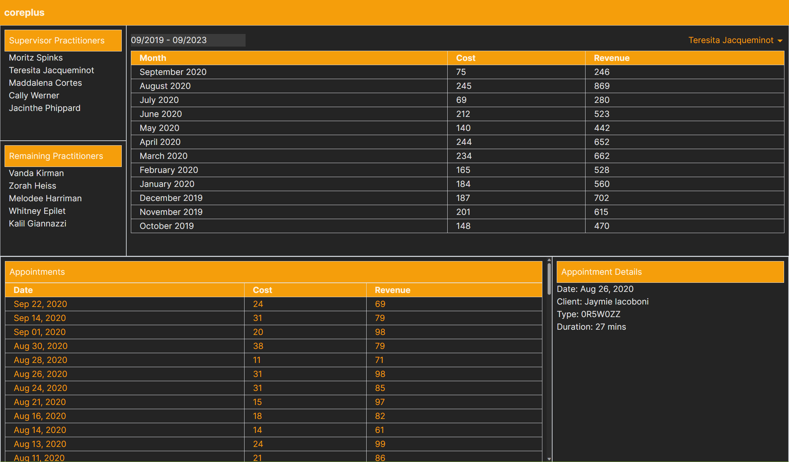

# coreplus-practical-exercise-2302

Make sure the ui port is whitelisted in the api project. This sample assumed that the UI is running on port 5173, hence the CORS configuration in the API project is set to allow requests from http://localhost:5173.

## coreplus-sample-ui

* Import Statements: The code starts with importing necessary libraries, including React, date-fns, and various components, styles, and data models.

* State Management: The useState hook is used to manage several pieces of state:

    1. practitioner: Represents the currently selected practitioner.
    2. appointment: Represents the currently selected appointment.
    3. showAppointments: Controls the visibility of the appointment list.
    4. startDate and endDate: Define the date range for the profitability analysis, initially set to a 4-year range.
    5. Date Picker: The DatePicker component from the "react-datepicker" library is used to allow users to select a date range. It's set up to display the month and year for selection.

* UI Structure:

    1. The app's UI is structured into different sections. The header displays the app's name, "coreplus."
    2. The Practitioner List component is shown to select a practitioner.
    3. If a practitioner is selected, it displays a date picker and the practitioner's name. Clicking on the practitioner's name toggles the visibility of appointment details.
    4. The ProfitabilityAnalysis component displays financial data for the selected practitioner within the chosen date range.
    5. Appointment List: If the "Show Appointments" button is clicked, the AppointmentList component is displayed, showing a list of appointments for the selected practitioner.
    6. Appointment Details: If an appointment is selected from the list, the AppointmentDetails component is displayed, providing more detailed information about the selected appointment.

* CSS Styling: CSS classes are used to style different parts of the application, providing a visually pleasing and responsive layout.

* Export: The App component is exported as the default component

### Suggested UI considerations

1. **Add Tooltips**: Incorporate tooltips or hover-over hints on buttons and icons to provide users with brief explanations of their functions.

2. **Error Handling**: Implement clear error messages and validation checks to guide users when they enter incorrect data or make mistakes.

3. **Confirmation Dialogs**: Use confirmation dialogs for critical actions (e.g., deleting data) to prevent accidental data loss.

4. **Keyboard Shortcuts**: Consider adding keyboard shortcuts for common actions to enhance accessibility and efficiency for power users.

5. **Consistent Terminology**: Ensure that labels, button text, and terminology are consistent throughout the application to avoid confusion.

6. **User Onboarding**: Create an onboarding process or a help section that introduces users to the app's features and functionalities.

7. **Progress Indicators**: Use loading spinners or progress bars to indicate when data is being fetched or processed to keep users informed.

8. **Responsive Design**: Continuously test the UI on various devices and screen sizes to ensure responsiveness and a consistent user experience.

9. **Accessibility**: Ensure that the application is accessible to users with disabilities by adhering to accessibility guidelines (e.g., WCAG).

10. **Performance Optimization**: Optimize the app's performance to reduce loading times and improve overall responsiveness.

11. **Feedback Mechanism**: Allow users to provide feedback, report issues, or request features directly within the application.

12. **Customization**: Consider adding user preferences or customization options (e.g., themes, language settings) to enhance personalization.

13. **Contextual Help**: Provide context-sensitive help or documentation that can be accessed within specific sections of the app.

14. **Clear Navigation**: Ensure that navigation menus and buttons are intuitive and clearly labeled to help users move around the app effortlessly.

15. **User Testing**: Continuously gather feedback through user testing and usability studies to identify pain points and areas for improvement.

16. **Performance Monitoring**: Implement tools to monitor application performance in real-time and address any performance bottlenecks promptly.

17. **Browser Compatibility**: Ensure compatibility with various web browsers to reach a broader user base.

18. **Security**: Maintain robust security measures to protect user data and build trust with users.

19. **Mobile-Friendly**: If not already, consider making the application more mobile-friendly to accommodate users on smartphones and tablets.

20. **Virtualization**: Consider implementing virtualization to improve performance and reduce the amount of data rendered by the application.

## coreplus-sample-api

### AppointmentService

   - `GetProfitabilityAnalysis(long id, DateTime[]? range)`: 
     - Retrieves profitability analysis data for a specific practitioner within an optional date range.
     - Reads appointment data from a JSON file.
     - Filters data based on practitioner ID and an optional date range.
     - Groups and calculates total revenue and cost per month for the selected practitioner.
     - Returns a collection of `ProfitabilityAnalysisDto`.

   - `GetByPractitionerId(long practitionerId)`:
     - Retrieves a list of appointment data for a specific practitioner.
     - Reads appointment data from a JSON file.
     - Filters data based on practitioner ID.
     - Orders the appointments by date in descending order.
     - Returns a collection of `AppointmentDto`.

   - `GetById(long id)`:
     - Retrieves detailed information for a specific appointment by ID.
     - Reads appointment data from a JSON file.
     - Filters data based on appointment ID.
     - Returns an `AppointmentDetailsDto` or null if not found.

   - File Service Dependency:
     - The `AppointmentService` class relies on an implementation of the `IFileService<Appointment>` interface to read appointment data from a file.

### PractitionerService

   - `GetPractitioners()`: 
     - Retrieves a list of all practitioners.
     - Reads practitioner data from a JSON file.
     - Maps the practitioner data to `PractitionerDto` objects containing practitioner ID and name.
     - Returns a collection of `PractitionerDto`.

   - `GetSupervisorPractitioners()`:
     - Retrieves a list of supervisor practitioners.
     - Reads practitioner data from a JSON file.
     - Filters the data to select practitioners with a level less than 2 (likely indicating supervisors).
     - Maps the filtered data to `PractitionerDto` objects containing practitioner ID and name.
     - Returns a collection of `PractitionerDto`.

   - File Service Dependency:
     - The `PractitionerService` class relies on an implementation of the `IFileService<Practitioner>` interface to read practitioner data from a file.

### Program.cs

**1. CORS Configuration:**
   - The constant `allowSpecificOrigins` is defined to specify the name of the CORS (Cross-Origin Resource Sharing) policy used in the application.
   - The `WebApplication` builder is created, initializing the application with any command-line arguments.
   - CORS is configured using the `AddCors` method to allow cross-origin requests from a specific origin (`http://localhost:5173` in this case). It permits any HTTP header and method for requests from this origin.

**2. Dependency Injection:**
   - The application's services are configured using dependency injection:
     - `IFileService<>` is registered as a singleton using `FileService<>`.
     - `PractitionerService` is registered as a singleton.
     - `AppointmentService` is registered as a singleton.

### Suggested API considerations

1. **Authentication**: Implement authentication to restrict access to sensitive data and protect against unauthorized access.
2. **Authorization**: Implement authorization to restrict access to specific resources and functionalities based on user roles.
3. **Input Validation**: Validate user input to prevent malicious attacks and ensure data integrity.
4. **Error Handling**: Implement clear error messages and validation checks to guide users when they enter incorrect data or make mistakes.
5. **Logging**: Implement logging to track application usage and errors and troubleshoot issues.
6. **API Documentation**: Provide comprehensive documentation for the API to help developers understand its features and functionalities.
7. **API Versioning**: Consider versioning the API to allow for future changes without breaking existing functionality.
8. **Performance Optimization**: Optimize the API's performance to reduce loading times and improve overall responsiveness.
9. **Security**: Maintain robust security measures to protect user data and build trust with users.
10. **Testing**: Implement unit tests and integration tests to ensure that the API functions as expected.
11. **Pagination**: Consider implementing pagination to improve performance and reduce the amount of data returned by the API. 

## coreplus-sample-api-test

**1. `GetPractitioners_Should_Return_CorrectResult`**
   - This is a unit test method marked with `[Theory]` and `[MemberData]` attributes, indicating it's a parameterized test.
   - It tests the `GetPractitioners` and `GetSupervisorPractitioners` methods of the `PractitionerService` class.

**2. Test Data:** The `[MemberData]` attribute provides test data in the form of an `IEnumerable<object[]>`. Each object array contains:
   - An `IEnumerable<Practitioner>` representing the input data.
   - An integer `expectedPractitioners`, which is the expected count of practitioners in the result.
   - An integer `expectedSupervisors`, which is the expected count of supervisor practitioners in the result.

**3. Test Setup:**
   - The test sets up a mock implementation of the `IFileService<Practitioner>` interface using a library like `NSubstitute`. It mocks the `ReadFileAsync` method to return the provided data.

   - An instance of the `PractitionerService` class is created with the mocked `IFileService`.

**4. Test Execution:**
   - The `GetPractitioners` and `GetSupervisorPractitioners` methods are called on the `PractitionerService` instance to retrieve practitioners and supervisor practitioners.

**5. Assertions:**
   - Assertions are made using `Assert.Equal` to check whether the actual results match the expected counts of practitioners and supervisor practitioners.

**6. Test Data Variations:**
   - The test method is executed with different sets of test data to cover multiple scenarios:
     - An empty list of practitioners.
     - A list of practitioners with various `PractitionerLevel` values.
     - A list of practitioners with some missing `PractitionerLevel` values.